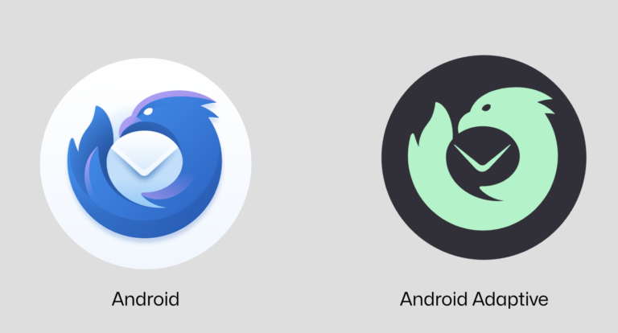

# 引入全新的 Thunderbird 徽标！

## 作品信息

- 原文：[Introducing The Brand New Thunderbird Logo!](https://blog.thunderbird.net/2023/05/introducing-the-brand-new-thunderbird-logo/)
- 作者：[Ryan Sipes](https://blog.thunderbird.net/author/ryanthunderbird-net/)
- 许可证：[CC-BY-SA 3.0](http://creativecommons.org/licenses/by-sa/3.0/)
- 译者：暮光的白杨
- 日期：2023-05-25

----

你好，Thunderbird 家人们！将近 20 年后，我们很高兴与大家分享完全重新设计的 Thunderbird 徽标，以纪念我们的历史和与 Mozilla 的重要联系，同时带领我们迈向下一个 20 年。

众所周知，在多年被视为停滞不前之后，Thunderbird 正在[复苏]。我们的项目正在以一种新的目标感蓬勃发展，我们看到了从我们的用户、我们的贡献者社区和我们的核心团队中冒出的令人振奋的能量。

[复苏]: https://blog.thunderbird.net/2023/05/thunderbird-is-thriving-our-2022-financial-report/

就像软件一样，Thunderbird 当前的徽标在过去 20 年中经历了小的迭代改进。但现在 Thunderbird 正在演变为更现代的东西（同时保留其强大的定制功能），我们相信它应该有一个新的徽标来恰当地代表这种复兴。

但人永远不应该忘记人的根源，这就是为什么我们请 Firefox 和 Thunderbird 最初标志的创造者 Jon Hicks 根据 Thunderbird 激动人心的未来重新构想他的标志设计。

下面是我们在 Linux、Windows、macOS、Android 和 iOS 上的新徽标。

是的，我们已经正式将 Thunderbird 的 iOS 版本添加到我们未来的开发路线图中。 预计到 2023 年底会有更多关于这方面的具体消息。

下面是我们最好的朋友 Firefox 旁边的 Thunderbird for Android 在 Android 设备上的样子：

{ width=70% }

什么时候你可以看到它集成至 Thunderbird？我们的计划是在今年夏天将新徽标引入 Thunderbird 115（代号 “[Supernova]”）。在接下来的几个月里，我们还将逐步重新设计我们的网站，并更新各种社交渠道和交流平台上的品牌。

[Supernova]: https://blog.thunderbird.net/tag/supernova/

我们理解改变可能会让人感到不舒服，但我们希望你赞同这是该项目积极的新面貌。我鼓励每个人都像我们在整个过程中所做的那样：暂时接受新设计。让它呼吸，让它沉入水中，几天后让我们知道你的想法。

我们都对旧的 Thunderbird 徽标情有独钟（我亲切地称之为“信封上的假发”），但我们的项目正在发生巨大而积极的变化，我们希望通过美丽、焕发活力的徽标和图标向世界清楚地展示这一点。

所以，为了美好的未来！ 我代表整个团队：感谢你与我们一起踏上这段旅程。没有你，我们就不会在这里。

<em>
Ryan Sipes 
Thunderbird 产品经理
</em>