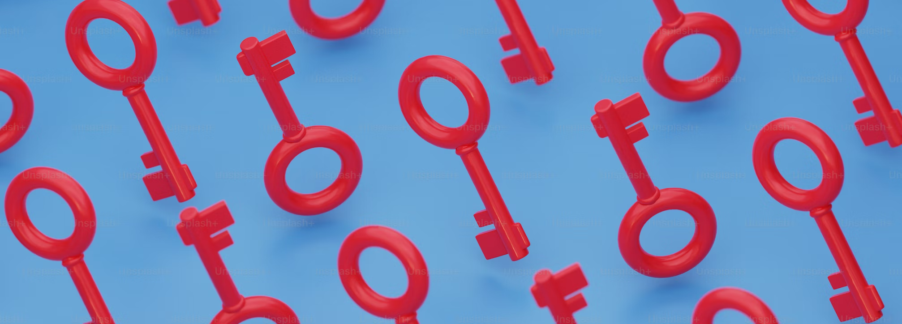

# Thunderbird 115 和使用过时的 SHA-1 算法的签名

- 译文信息：
    - 原文：[Thunderbird 115 and Signatures Using The Obsolete SHA-1 Algorithm](https://blog.thunderbird.net/2023/10/thunderbird-115-and-signatures-using-the-obsolete-sha-1-algorithm/)
    - 作者：[Kai Engert](https://blog.thunderbird.net/author/kaiekuix-de/)
    - 许可证：[CC-BY-SA 3.0](http://creativecommons.org/licenses/by-sa/3.0/)
    - 译者：暮光的白杨
    - 日期：2023-10-31

---

作为我们不断加强 Thunderbird 安全性努力的一部分，我们在 115.0 版本中进行了一项更改，拒绝在 [S/MIME] 电子邮件的数字签名中使用 SHA-1 算法。

[S/MIME]: https://en.wikipedia.org/wiki/S/MIME

如今，SHA-1 算法在大多数情况下都被认为是不安全的，其中包括数字签名，相关的[维基百科文章]对此作了解释。

[维基百科文章]: https://en.wikipedia.org/wiki/SHA-1

由于 Thunderbird 115 中的更改，当显示受影响的邮件时，将报告签名无效。

你可以通过查看信息源，搜索信息标题中的 **micalg=** 文本来发现此类信息。如果后面跟着 **sha-1** 或 **sha1** 文本，则应联系你的联系人并要求他们升级签名。

大多数支持 S/MIME 的现代电子邮件软件应该已经能够使用另一种哈希算法，例如 [SHA-256]，这是一种更现代的替代算法。你可能需要更改设置才能使用它。

[SHA-256]: https://en.wikipedia.org/wiki/SHA-2

Thunderbird 团队最近意识到，在某些环境中仍然需要使用 SHA-1，因为一些政府机构继续发送基于 SHA-1 的消息。尽管存在签名可能被伪造的风险，此类消息的接收者仍要求找到一种方法来确认此类签名的有效性。

为了适应这些 Thunderbird 用户的需求，从 115.4.1 版本开始，Thunderbird 将提供新的配置机制，可用于接受基于 SHA-1 的 S/MIME 签名。如果你要启用它，请通过 Thunderbird 的设置，访问高级配置编辑器，搜索设置 **mail.smime.accept_insecure_sha1_message_signatures** 并将其设置为值 `true`。

请注意，我们不建议更改此设置，如果你决定设置它，你应该与你的联系人合作，让他们尽快更改为 SHA-256 或更新版本。一旦你的联系人升级，你应该将此设置恢复为 `false`。

更改此设置不会影响 Thunderbird 发送的消息。Thunderbird 在发送数字签名的 S/MIME 电子邮件时使用 SHA-256，并且已经这样做了好几年了。

Thunderbird 团队明白，考虑到一些用户遇到的不兼容性，在其他软件仍在使用不安全算法的情况下要求弃用它似乎为时过早。然而，为了符合我们提高用户安全性的使命，我们希望我们的行动能够提高人们的认识并激励部署升级到更安全的设置，否则他们可能不会这样做。