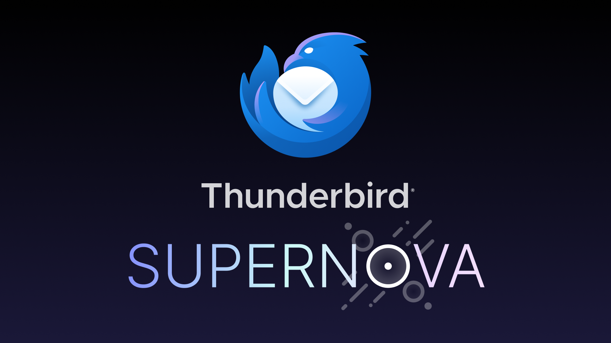
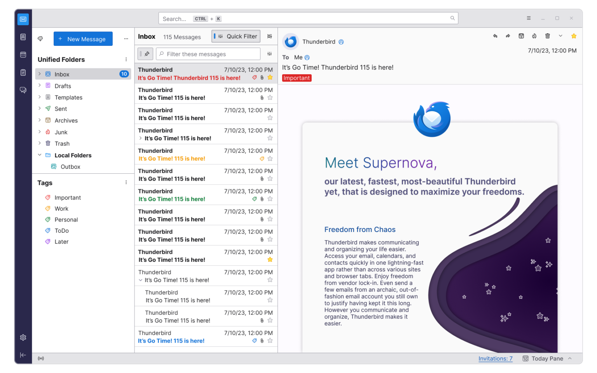
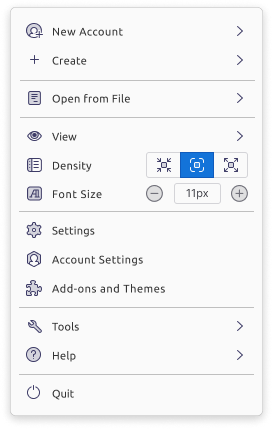
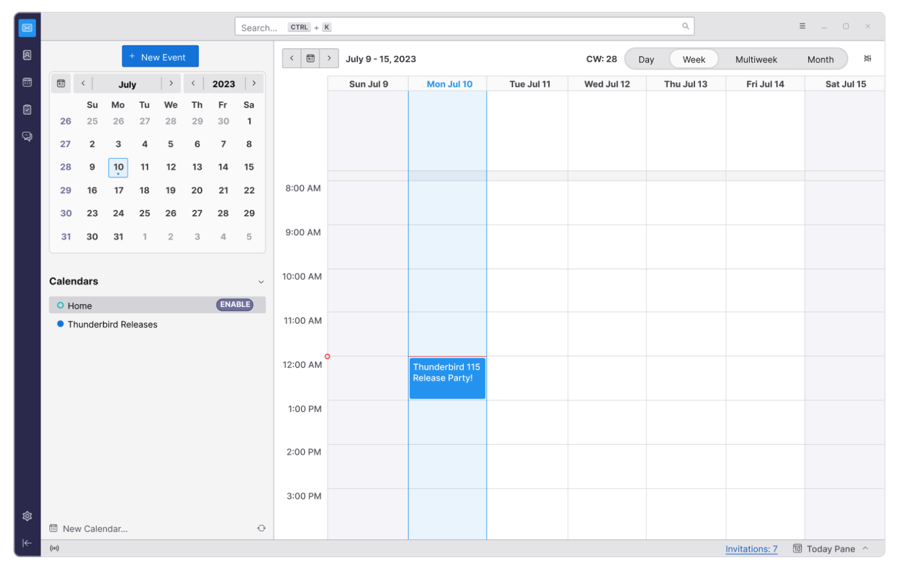
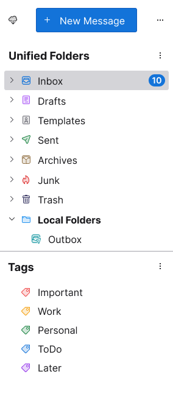

# 我们有史以来最快、最美的版本：Thunderbird 115 “Supernova” 来了！

- 译文信息：
    - 原文：[Our Fastest, Most Beautiful Release Ever: Thunderbird 115 “Supernova” Is Here!](https://blog.thunderbird.net/2023/07/our-fastest-most-beautiful-release-ever-thunderbird-115-supernova-is-here/)
    - 作者：[Jason Evangelho](https://blog.thunderbird.net/author/jasonthunderbird-net/)
    - 许可证：[CC-BY-SA 3.0](http://creativecommons.org/licenses/by-sa/3.0/)
    - 译者：暮光的白杨
    - 日期：2023-07-12

---

我谨代表 Thunderbird 团队、[Thunderbird 委员会]、我们的全球贡献者社区以及我们的 Mozilla 大家庭，无比激动地宣布首次推出适用于 Linux、macOS 和 Windows 的 Thunderbird 115 “Supernova”！在今年的版本中，我们提供的不仅仅是另一个年度版本。Supernova 代表着软件在视觉上和技术上的现代化改造，同时保留了你对 Thunderbird 所期望的熟悉性和灵活性。

[Thunderbird 委员会]: https://wiki.mozilla.org/Modules/Thunderbird#Thunderbird_Council

“Supernova 标志着 Thunderbird 新时代的开始，”Thunderbird 产品和业务开发经理 Ryan Sipes 说道。“它为未来的版本奠定了美好而坚实的基础，使 Thunderbird 成为一个明显更好的电子邮件客户端——在它成为最佳选择之前我们不会停下脚步。”

Thunderbird 产品工程总监 Alex Castellani 表示：“在过去的一年里，我们重新设计了代码库中一些最老的部分，目标是对其进行现代化改造，使维护和可扩展性变得更加容易。我们尽最大努力在新功能和界面更改之间取得舒适的平衡，以吸引新用户，同时保持数百万用户熟悉和喜爱的当前布局和界面。这是迈向更加灵活、可靠和可定制的 Thunderbird 的[第一步]，它将适应不同的需求、偏好和工作流程。”

[第一步]: https://blog.thunderbird.net/2023/02/the-future-of-thunderbird-why-were-rebuilding-from-the-ground-up/

以下是 Thunderbird 115 的一些最佳新功能和改进。如需完整列表，请访问[此支持文章]。

[此支持文章]: https://support.mozilla.org/en-US/kb/new-thunderbird-115-supernova

---

## 现代化的卡片视图

Supernova 的新卡片视图是我们邮件列表中，众所周知的垂直布局的版本，非常适合习惯现代网页邮件的人们。卡片视图模拟了移动界面的列表，支持多行，提供了更舒适的外观，减轻了认知负担。(因为我们希望 Supernova 能让老用户感到熟悉，所以传统的“表格”视图仍然可用）。

## 全新的 Thunderbird 徽标

Supernova 配备了全新的 Thunderbird 徽标，以纪念我们的历史以及与 Mozilla 的重要联系，同时代表着我们品牌的复兴和充满希望、可持续的未来。

## 动态统一工具栏

Supernova 采用单一动态工具栏，根据当前激活的标签或空间显示常用和上下文选项。通过自定义工具栏和窗口布局，你可以完全掌控自己的工作流程。

## 直观的应用程序菜单

Supernova 中的新应用程序菜单 (≡）现在可以通过键盘访问，并经过重新设计，以实现更快、更轻松的导航。更少的子菜单、持久的全局选项和一致的图标相结合，创造出更加直观的体验。

{ width=40% }  
新的 Thunderbird 应用菜单 ≡

## 改进的日历设计

作为 Thunderbird 日历现代化和升级的持续努力的一部分，Supernova 引入了改进的 “mini-month” 布局、日/周/月网格、令人愉悦的调色板以及其他一些细微的更改。

## 优雅的密度控制

  
从新的应用程序菜单轻松更改密度设置和字体大小

使用多个显示器和显示分辨率？Supernova 让你只需从应用程序菜单中单击一下即可为整个应用程序设置完美的密度设置和字体大小。

## 可排序文件夹模式

Supernova 通过引入可排序文件夹模式为你提供更多控制。在文件夹窗格中显示所有标签，打开和关闭本地文件夹，或一键上下移动你最喜欢的文件夹模式部分。更少的滚动，更高的生产力。

## 引人注目的标签视图

标签是你工作流程中熟悉且强大的部分，因此 Supernova 在文件夹窗格中添加了引人注目的“标签”视图。你可以快速跳转到自定义颜色编码的标签类别，以更快地查找和过滤你的消息。

## 改进的地址簿

Supernova 继续迭代 Thunderbird 102 中引入的现代化地址簿。你将享受新的表格视图、改进的编辑视图、删除按钮和更好的可访问性。

## 更好的可访问性

说到可访问性，Supernova 极大地改进了 Thunderbird 在整个应用程序中的键盘导航和屏幕阅读器的可访问性。我们还极大地扩展了使用 TAB 和箭头键导航邮件内容和按钮的能力。

## 即将推出更多内容

Supernova 在不断演化。在接下来的一年里，我们将对 Supernova 现有的功能进行许多改进，并推出全新的功能，包括 Thunderbird Sync。升级至 115 版本，体验 Thunderbird 的未来！

---

## 如何获得 Thunderbird 115 “Supernova”

与任何主要版本一样，我们有时会在大量公开测试后意识到一些极端情况。Thunderbird 团队将等待启用自动更新，直到我们确信不存在此类问题。我们将在此处和社交媒体平台上随时向你发布最新消息（在此期间，现有 Thunderbird 102 用户将继续收到安全更新）。

在 Linux 上，此版本和后续自动更新的时间可能由你的发行版的维护人员确定。如果你方便的话，我们建议你安装[来自 Flathub 的 Thunderbird Flatpak][flatpak]，它现在由 Thunderbird 团队打包和维护。（请注意，截至本文发布时，115 尚未在 Flathub 上上线，但我们会一如既往地为你提供最新信息。）

[flatpak]: https://flathub.org/apps/org.mozilla.Thunderbird

如果你不想等待自动更新，也可以直接从 [Thunderbird.net] 下载适用于 Windows、Linux 和 macOS 的 Thunderbird 115。（当你访问那里时，请查看酷炫的 102 与 115 比较滑块。）

[Thunderbird.net]: https://thunderbird.net/