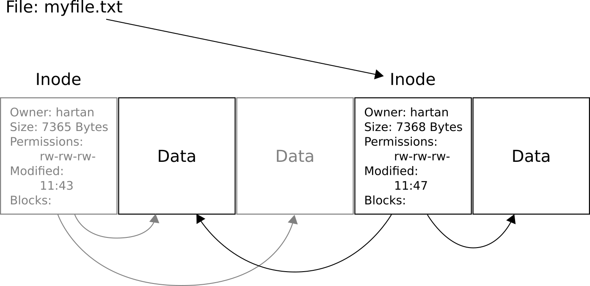

# 使用 Btrfs：一般概念

## 作品信息

- 原文：[Working with Btrfs – General Concepts](https://fedoramagazine.org/working-with-btrfs-general-concepts/)
- 作者：[Andreas Hartmann](https://fedoramagazine.org/author/hartan/)
- 许可证：[CC-BY-SA 4.0](http://creativecommons.org/licenses/by-sa/4.0/)
- 译者：暮光的白杨
- 日期：2022-10-06

----

本文是深入了解 Btrfs 的系列文章的一部分。这是自 Fedora Linux 33 以来 Fedora Workstation 和 Fedora Silverblue 的默认文件系统。

## 介绍

文件系统是现代计算机的基础之一。 它们是每个操作系统的重要组成部分，它们通常在不被注意的情况下工作。但是，诸如 Btrfs 之类的现代文件系统提供了许多强大的功能，使使用计算机更加方便。除了其他功能之外，它们还可以为你透明地压缩文件或为增量备份奠定坚实的基础。

本文将为你提供 Btrfs 文件系统如何工作以及它具有的一些功能的高级概述。本文不会涉及太多技术细节，也不会详述具体实现。在本系列后面的文章中，将对一些突出的特性进行更详细的解释。

## 什么是文件系统？

如果你以前听说过文件系统在最基本的层面上是如何工作的，那么这对你来说并不陌生，你可以跳到下一节。否则，请继续阅读，以了解文件系统最初是如何形成的。

简单来说，文件系统允许您的 PC 找到它存储在磁盘上的数据。 这听起来像是一项微不足道的任务，但从本质上讲，今天任何类型的非易失性存储设备（例如 HDD、SSD、SD 卡等）仍然大多是 1970 年发明 PC 时的样子：一个（巨大）存储块的集合。

块（Blocks）是最细粒度的可寻址存储单元。您的 PC 上的每个文件都存储在一个或多个块中。一个块的大小通常为 4096 字节。具体取决于您拥有的硬件和和上面的软件（即文件系统）。

文件系统允许我们从大量可用的存储块中找到文件的内容。这是通过所谓的索引节点（inode）完成的。一个索引节点在一个特殊格式的存储块中包含了关于一个文件的信息。这些信息包括文件的大小、在哪里可以找到构成文件内容的存储块、其访问规则（即谁可以读取、写入或执行文件）等等。

下面是一个例子：

!!! example "样例"
      
    文本文件 “myfile.txt” 及其在磁盘上的假设示例。所有的方块都是单独的存储块。

索引节点的结构对文件系统的功能有很大的影响，因此它是任何文件系统的中心数据结构之一。因此，每个文件系统都有自己的索引节点结构。如果您想了解更多信息，请查看下面链接的 Btrfs 文件系统的索引节点结构[^1]。有关各个字段含义的更详细说明，您可以参考 ext4 文件系统[^2]的索引节点结构。

## 写时复制（CoW）文件系统

例如，与 ext4 相比，Btrfs 的突出特点之一是它是一个写时复制（Copy-on-Write, CoW）文件系统。当文件被更改并写回磁盘时，它不会被有意写回原来的位置。相反，它会被复制并存储在磁盘上一个全新的位置。从这个意义上说，将 CoW 视为一种“重定向”可能更易于理解，因为文件写入被重定向到不同的存储块。

这听起来可能很浪费，但实际上并非如此。这是因为无论文件系统如何工作，在任何情况下都必须将修改后的数据写回磁盘。Btrfs 只是确保将数据写入以前未占用的块，因此旧数据保持不变。这种行为唯一真正的缺点是 Btrfs 会比其他文件系统更快地产生文件碎片。在常规桌面使用场景中，您不太可能会注意到差异。

CoW 的优势是什么？简单来说：可以保留修改和编辑文件的历史记录。Btrfs 会将对旧文件版本（索引节点）的索引保存在可以轻松访问的地方。此索引就是一个快照(snapshot)：文件系统状态在某个时间点的镜像。这将是本系列中另一篇文章的主题，所以现在就这样吧。

除了保持文件历史之外，CoW 文件系统总是处于一致的状态，即使之前的文件系统事务（如写入文件）由于断电等原因没有完成。这是因为文件系统元数据的更新也是 CoW 的：文件系统本身永远不会被覆盖，所以中断不会让它处于部分写入的状态。

## 文件的写时复制

您可以将文件名视为指向它们所属文件的索引节点的指针。写入文件后，Btrfs 会创建一个修改后的文件内容（数据）的副本，以及一个新的索引节点（元数据），然后让您的文件名指向这个新的索引节点。旧的索引节点保持不变。下面你会看到另一个假设的例子来说明这一点：

!!! example "样例"
      
    继续上面的例子：增加了 3 个字节的数据  

如上，“myfile.txt” 添加了三个字节。传统的文件系统会更新上图最中间的“数据”（Data）块以包含新内容。CoW 文件系统则会保持（以灰色显示的）旧块完好无损并将更改的数据和元数据写入（复制）到新的地方。需要注意的是，CoW 只复制更改的数据块，而不是整个文件。

如果没有更多未使用的块可写入新内容，Btrfs 将从旧文件版本占用的数据块中回收空间（除非它们是快照的一部分，请参阅本系列后面的文章）。

## 文件夹的写时复制

从文件系统的角度来看，文件夹是一种特殊类型的文件。与常规文件相比，文件系统直接解释底层内容。文件夹有一些与之关联的元数据（一个索引节点，如上面的文件所示），用于控制访问权限或修改时间。在最简单的情况下，存储在文件夹中的数据（所谓的“目录条目”）是对索引节点的索引列表，其中每个索引节点又是另一个文件或文件夹。但是，现代文件系统在目录条目中至少存储了一个文件名，以及对相关文件的索引节点的索引。

如前文所述，写入文件会创建前一个索引节点的副本并相应地修改内容。从本质上讲，这产生了一个新的索引节点，它与前一个索引节点没有关系。为了使修改后的文件显示在文件系统中，所有包含指向它的索引的目录条目也会被更新。

这是一个递归过程！ 由于文件夹本身就是一个带有索引节点的文件，因此修改它的任何文件夹条目都会为文件夹文件创建一个新的索引节点。这种递归一直发生在文件系统树上，直到它到达文件系统根。

因此，只要保留对任何旧目录的索引并且它们没有被删除或覆盖，文件系统树就可以切换至先前的状态。同样，这正是快照所做的。

## 未来的文章中会写什么

Btrfs 不仅仅是一个 CoW 文件系统。 它旨在“实现高级功能，同时还关注容错、修复和易于管理”（参见 [^3]）。 本系列的未来文章将特别关注这些功能：

- 子卷（Subvolumes）——文件树中的文件树
- 快照（Snapshots）——时光倒流
- 压缩——透明地节省存储空间
- Qgroups ——限制你的文件系统大小
- RAID ——替换您的 mdadm 配置

到目前为止，这还不是 Btrfs 功能的详尽列表。如果您想了解可用功能的完整概述，请查看 Wiki [^4] 和 Docs [^3]。

## 结论

我希望我能激发您了解您的 PC 文件系统的兴趣。到目前为止，如果您有任何疑问，请对您的想法[发表评论](https://fedoramagazine.org/working-with-btrfs-general-concepts/#respond)，以便在以后的文章中进行讨论。同时，请随意研究文本中的链接资源。如果您偶然发现了一个特别有趣的 Btrfs 功能，也请在下方添加评论。如果对某个特定主题有足够的兴趣，也许我会在该系列中添加一篇文章。下一篇文章见！

[^1]: https://btrfs.wiki.kernel.org/index.php/Data_Structures#btrfs_inode_item
[^2]: https://ext4.wiki.kernel.org/index.php/Ext4_Disk_Layout#Inode_Table
[^3]: https://btrfs.readthedocs.io/en/latest/Introduction.html
[^4]: https://btrfs.wiki.kernel.org/index.php/Main_Page