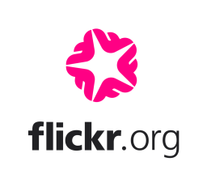
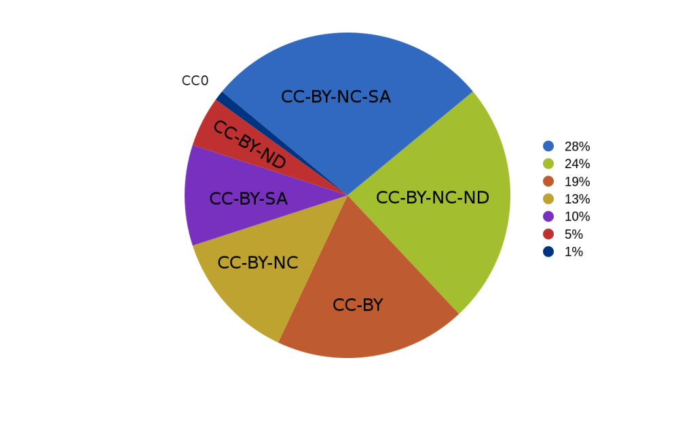
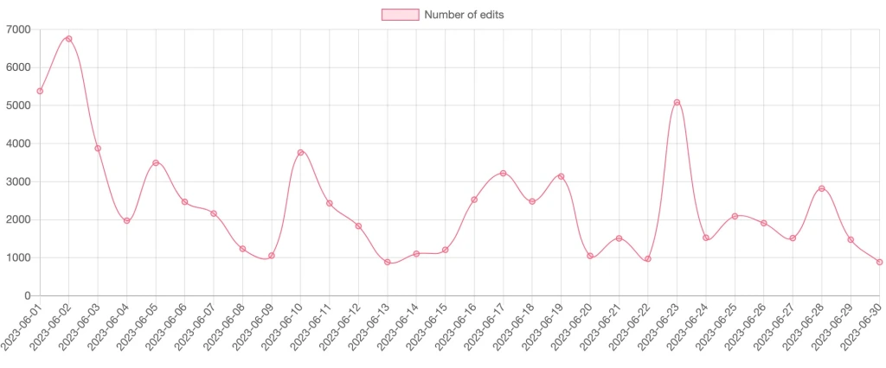
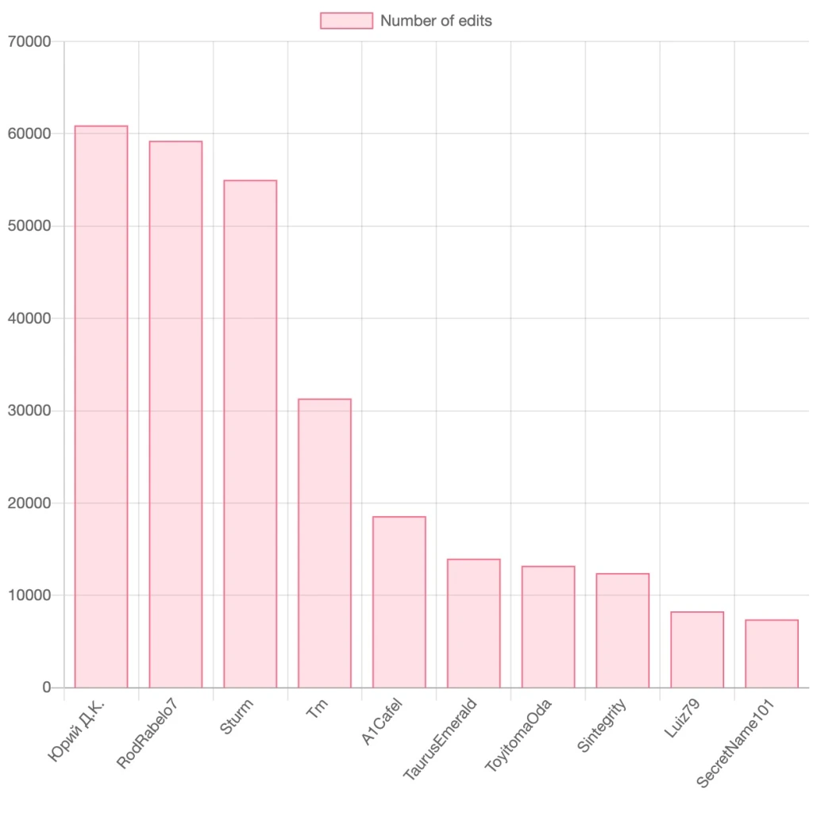

# Flickr 基金会正在 Flickr 和维基共享资源之间架起一座新桥梁

- 译文信息：
    - 源文：[Flickr Foundation is building a new bridge between Flickr and Wikimedia Commons](https://diff.wikimedia.org/2023/07/07/flickr-foundation-is-building-a-new-bridge-between-flickr-and-wikimedia-commons/)
    - 作者：[Giovanna Fontenelle](https://diff.wikimedia.org/author/gfontenelle-wmf-2-2-2-2-2-2-2-2-2-2-2-2-2-2-2-2-2/)、[Jessamyn West](https://diff.wikimedia.org/author/jessamyn-west/) 和 [George Oates](https://diff.wikimedia.org/author/george-oates/)
    - 许可证：[CC BY-SA 4.0]
    - 译者：暮光的白杨
    - 日期：2023-07-09

----

  
<grey>Flickr 徽章（来自德国的 poolie，CC BY 2.0，来自维基共享资源）</grey>

我们很高兴地宣布与 [Flickr 基金会][Flickr]建立新的合作伙伴关系，以扩展通过 [Flickr2Commons] 工具已经完成的出色工作，使从 Flickr 上传 [CC] 许可的图片到[维基共享资源]更加容易。

[Flickr]: https://www.flickr.org/
[CC BY-SA 4.0]: https://creativecommons.org/licenses/by-sa/4.0/
[Flickr2Commons]: https://commons.wikimedia.org/wiki/Commons:Flickr2Commons
[CC]: https://creativecommons.org/
[维基共享资源]: https://en.wikipedia.org/wiki/Wikimedia_Commons

维基百科是互联网上的基本信息来源。它为谷歌和其他搜索引擎、社交媒体平台、语音助手以及越来越多的人工智能应用程序提供内容。为了提供这些信息，我们创建了维基共享资源，这是维基百科的中心视觉平台，也是在线开放许可视觉内容的主要来源之一。你可能不知道，维基共享资源最大的来源之一是 Flickr。

自 2004 年以来，Flickr 一直是在线上传照片、视频、插图等内容的摄影师和业余爱好者最受欢迎的平台之一。它也是知识共享许可内容的最大在线存储库之一。Flickr 成员可以为其上传内容分配许可证，包括维基共享资源接受的知识共享许可证：署名 (CC-BY)、署名-相同方式共享 (CC-BY-SA)、公共领域奉献 (CC0) 和公共领域标记。

<grey>2021 年 Flickr 上知识共享的使用情况分布（P,TO 19104，CC0，来自维基共享资源）</grey>

2008 年，Flickr 启动了 [Flickr Commons] 计划，以增加公众对世界各地图书馆、博物馆和档案馆收藏的摄影作品的访问。Flickr Commons 中的图像共享方式与许可证略有不同。这是一个名为“没有已知的版权限制”的**主张**。该计划[支持 100 多个成员机构][support]，包括[美国国家档案馆]、[NASA on Commons]、[苏格兰国家图书馆]和 [Ljósmyndasafn Reykjavíkur]。

[Flickr Commons]: https://www.flickr.com/commons
[support]: https://www.flickr.com/commons/institutions
[美国国家档案馆]: https://www.flickr.com/photos/usnationalarchives/
[NASA on Commons]: https://www.flickr.com/photos/nasacommons/
[苏格兰国家图书馆]: https://www.flickr.com/photos/nlscotland/
[Ljósmyndasafn Reykjavíkur]: https://www.flickr.com/photos/reykjavikmuseumofphotography/

2022年，[Flickr 基金会][Flickr]成​​立。它是一家美国 [501(c)(3)] 非营利组织，其目标是为未来保护 Flickr 及其数百亿张照片。它致力于发展和维持“……一个可访问的社会和技术基础设施，以保护（这一）宝贵的藏品。”

[501(c)(3)]: https://en.wikipedia.org/wiki/501(c)(3)_organization

Flickr 和维基共享资源之间的这座桥梁（我们开始称之为 “**[Flickypedia]**”）是 Flickr 基金会的旗舰项目之一。我们将与维基媒体基金会合作，在文化和遗产团队的支持下，以 [Flickr2Commons] 工具的实用性为基础，对其进行扩展，然后对其进行长期维护。

该项目已在 Wikimedia 基金会 2023-2024 [年度计划]的“公平/文化与遗产”部分、Flickr 基金会的[邮件列表更新]以及维基共享资源的 Village Pump 的[随后相关讨论]中提到。

[年度计划]: https://meta.wikimedia.org/wiki/Wikimedia_Foundation_Annual_Plan/2023-2024/Goals/Equity
[邮件列表更新]: https://web.archive.org/web/20230602045536/https://mailchi.mp/c6a1d40b1748/new-news-for-you-about-flickrorg
[随后相关讨论]: https://commons.wikimedia.org/wiki/Commons:Village_pump/Archive/2023/06#Flickr_Foundation_adopts_Flickr2Commons
[Flickypedia]: https://commons.wikimedia.org/wiki/Commons:Flickypedia

## 关于 Flickr2Commons

Flickr2Commons 是维基共享资源贡献者用来将单个或多个文件从 Flickr 上传到维基共享资源的流行工具。它是由 [Magnus Manske] 创建的，并于 2013 年首次推出，距今已有十年了！该工具允许用户身份验证、检查所需的许可证、包括元数据编辑步骤，然后进行文件传输。

[Magnus Manske]: https://en.wikipedia.org/wiki/Magnus_Manske?wprov=wppw2

## 对 Flickypedia 很重要的指标

为了衡量 Flickypedia 的可能覆盖范围，我们想要了解 Flickr2Commons 指标。 Magnus 帮助汇总的统计数据显示，自发布以来，大约 2000 个用户已上传了大约 540 万个文件。使用 [Wikimedia Hashtags][hashtags] 工具，我们还可以了解当今 Flickr2Commons 的使用量。仅在 2023 年 6 月，就有 147 位用户上传了 71,689 个文件。

<grey>2023 年 6 月使用 Flickr2Commons 工具进行的编辑（即上传）数量（[Hashtags tool][hashtags]）</grey>

[hashtags]: https://hashtags.wmcloud.org/

我们还发现了过去六个月（2023 年 1 月至 6 月）内 Flickr2Commons 最活跃的用户。

<grey>2023 年 1 月至 6 月 Flickr2Commons 最活跃的用户（[Hashtags]）</grey>

整理 Flickr2Commons 所有的使用统计数据真是太棒了——既有最新的数据，也有过去 10 年的总计数据。看到这一切给了我们一个明确的目标，让我们在新的版本中努力去匹配。

还值得注意的是，[UploadWizard] 是另一个将 Flickr 连接到维基共享资源的工具。我们要记住，这意味着会有更多的图片通过该工具从 Flickr 上传。准备这些指标让我们了解到如何使用 Flickypedia 更轻松地预测未来。

[UploadWizard]: https://www.mediawiki.org/wiki/Extension:UploadWizard

## 我们的时间表

Flickypedia 合作项目于 2023 年 6 月正式启动。我们计划在接下来的六个月左右构建 Alpha 版本（希望在 10 月展示），然后是 1.0 版本（希望在 12 月）。如果你想参与测试或提交关于 Flickr2Commons 的反馈，请与我们[保持联系][talk]。

[talk]: https://commons.wikimedia.org/wiki/Commons_talk:Flickypedia

- 有关 7 月至 12 月的计划，请访问维基共享资源上的[项目页面][Flickypedia]。
- 如需反馈，请通过维基共享资源上的[讨论页面][talk]与我们联系。