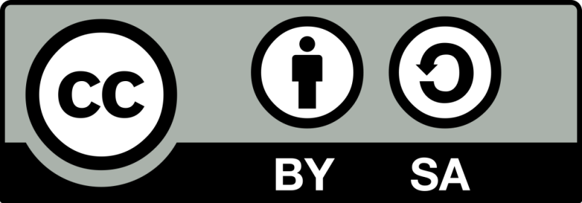
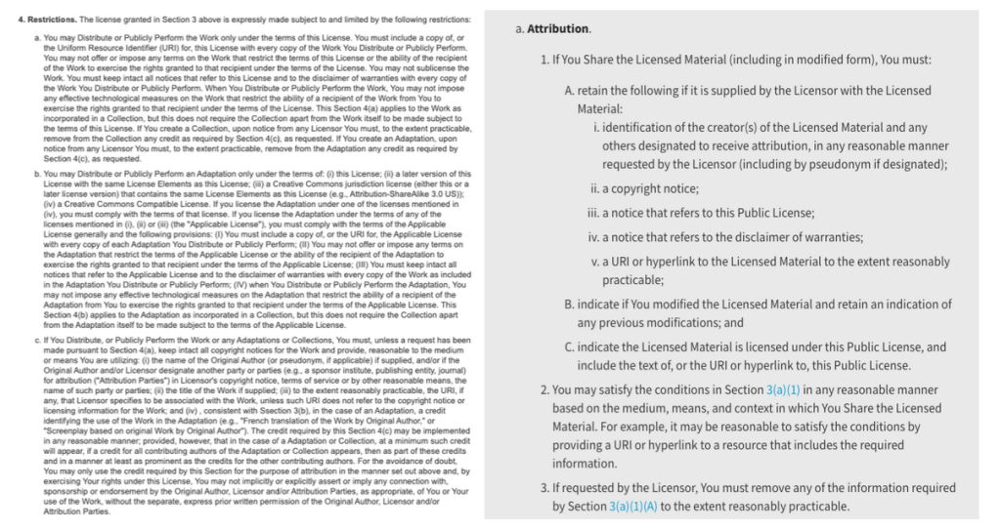

# 迈向未来：Wikimedia 项目过渡到知识共享 4.0 许可证

- 译文信息：
    - 源文：[Stepping into the future: Wikimedia projects’ transition to Creative Commons’ 4.0 license](https://diff.wikimedia.org/2023/06/29/stepping-into-the-future-wikimedia-projects-transition-to-creative-commons-4-0-license/#translate-post)
    - 作者：[Stephen LaPorte](https://diff.wikimedia.org/author/slaporte/)、[Jacob Rogers](https://diff.wikimedia.org/author/jacob-rogers/) 和 [Shaun Spalding](https://diff.wikimedia.org/author/shaun-spalding/)
    - 许可证：[CC BY-SA 4.0]
    - 译者：暮光的白杨
    - 日期：2023-07-03

----

*[Wikimedia] 基金会很高兴地宣布更新我们的[知识共享署名-相同方式共享 4.0 许可证][CC BY-SA 4.0]，这是我们最近使用条款更新的主要变更之一，它使 Wikimedia 项目达到最新版本的知识共享许可证。*

  
<grey>知识共享署名-相同方式共享徽章。图片由 [Creative Commons] 提供，基于 [CC BY-SA 4.0] 授权使用。</grey>

[Wikimedia]: https://www.wikimedia.org/
[CC BY-SA 4.0]: https://creativecommons.org/licenses/by-sa/4.0/
[CC BY-SA 3.0]: https://creativecommons.org/licenses/by-sa/3.0/
[Creative Commons]: https://creativecommons.org/
[tou]: https://meta.wikimedia.org/wiki/Wikimedia_Foundation_Legal_department/2023_ToU_updates

作为最近的[使用条款（ToU）更新][tou]的一部分，我们很高兴地宣布一项已经在许多 Wikimedia 项目中生效的变更：Wikimedia 项目许可已从知识共享署名-相同方式共享 3.0（CC BY-SA 3.0）更新为知识共享署名-相同方式共享 4.0（CC BY-SA 4.0）。

在这篇博文中，我们将讨论此更新对用户意味着什么，以及它将如何对每天为维基百科做出贡献、转发和重新混合的数百万志愿者产生积极影响。

## 什么是知识共享许可，为什么它们对于自由知识和 Wikimedia 项目很重要？

知识共享许可是一种法律工具，允许为维基百科这样的大规模、去中心化项目做贡献的人们可以创造自由的文化内容！根据知识共享许可向 Wikimedia 项目贡献的内容允许其他人重复使用和重新混合。这使得这些项目能够自由地向世界各地的人们提供知识。

知识共享许可允许创作者（例如维基百科的编辑者）保留版权，同时允许复用者（在自己的作品中使用知识共享内容来帮助共享知识的人）复制、分发和重新发布相关作品，只要他们遵循两个主要原则条件：“归属”限制意味着复用者必须注明原作者；“相同方式共享”限制意味着复用者必须以相同或等效许可下共享他们对原作品的任何任何改编。通过这种方式，知识共享许可使只是能够得到广泛的应用，有助于在人们开发新知识时自由地提供新知识，并有助于确保接收和使用相关知识的人被告知这些知识的来源，以便他们能够知道其来源并继续为其作出贡献。

## 为什么我们要将许可证更新至 CC BY-SA 4.0？

维基百科从之前的 [CC BY-SA 3.0] 许可证更新为 [CC BY-SA 4.0] 许可证，有助于使项目更易于访问、全球兼容、简化和可读。

### 1、新的知识来源

多年来，在 cc-by-sa 4.0 许可下创建的新知识无法**直接**添加到维基百科。现在可以了！例如，联合国机构和[国家政府][gov]已根据 cc-by-sa 4.0 授权其出版物，这些与旧版本的许可证不匹配。现在，来自联合国的出版物可以直接上传到 Wikimedia 项目，用于在文章中提供来源、引文或描述。这为项目提供了大量的新材料供其使用和构建，并帮助每个人更接近让世界上的知识为任何人、任何地方的人自由提供的愿景。

[gov]: https://wiki.creativecommons.org/wiki/Government_use_of_Creative_Commons

### 2、国际化

cc-by-sa 4.0 许可证被设计为**全球**许可证。原先的 cc-by-sa 3.0 有多个版本的许可证，具体取决于使用它们的国家和地区。现在，cc-by-sa 4.0 是一个适用于全球的单一许可证，[并提供 30 多种语言的官方翻译，而且还将有更多的翻译][more]！这消除了对许可证的不同移植版本的需要，也就是说，不再需要为了在特定的司法管辖区使用而改变语言版本。它还消除了用户自行翻译以移植许可证的需要。这种普适性促进了正在加强的跨项目和国界的全球合作，因此这一变更对于实现 2030 年 Wikimedia 运动目标至关重要。

[more]: https://wiki.creativecommons.org/wiki/Legal_Tools_Translation

### 3、简化归属要求

CC BY-SA 4.0 让复用者更轻松地了解如何注明作品的原始作者。例如，它澄清了允许链接到带有归属信息的网页，这很有帮助，因为这样做已经成为提供归属的常见方法。它还使人们能够在合理的时间内修复归属错误：这对于帮助解决简单的错误非常重要，而无需过度激进的版权执法要求，并使自由知识内容可以更安全地供世界上任何地方的人们使用，这些人可能是首次发现并尝试贡献自由内容。

### 4、许可证文本本身更具可读性

我们在下面提供的许可证的并排比较显示了许可证语言现在如何更清晰易读。这很重要，因为它可以帮助为维基百科等项目做出贡献的人们，以及想要在自己的工作中使用维基百科信息的人们了解许可证。更清晰、更条理的文本意味着更少的归属错误以及更广泛地使用该材料来实现公共利益。

  
<grey>CC BY-SA 3.0（左）和 CC BY-SA 4.0（右）许可证中的一些文本的并排比较，说明新版本如何更加简洁。</grey>

你可以在[知识共享的解释][explain]中找到有关 4.0 版本新增内容的更多信息。

[explain]: https://creativecommons.org/version4/

## 结论

更新至 CC BY-SA 4.0 将帮助 Wikimedia 项目作为共享自由知识的开放、协作平台继续蓬勃发展。此次更新使项目内容对全球社区更具适应性和可用性，使大量新材料与 Wikimedia 项目兼容，并使我们的平台与开放许可的最新标准保持一致。

我们对更加现代、灵活且易于使用的自由知识许可的新篇章感到兴奋。志愿者编辑已经开始更新维基上的相关政策文件，以便我们能够实施这一变化，并更好地将其传达给不同 Wikimedia 项目和语言的志愿者。如果你看到网页的许可证版本已过期，请随时更新！