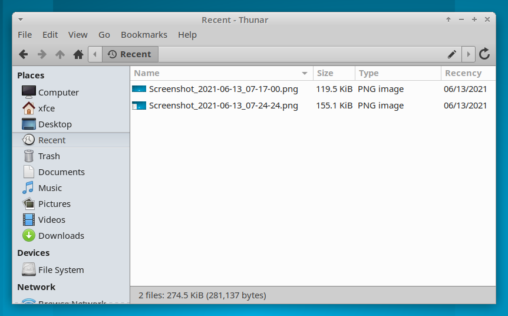
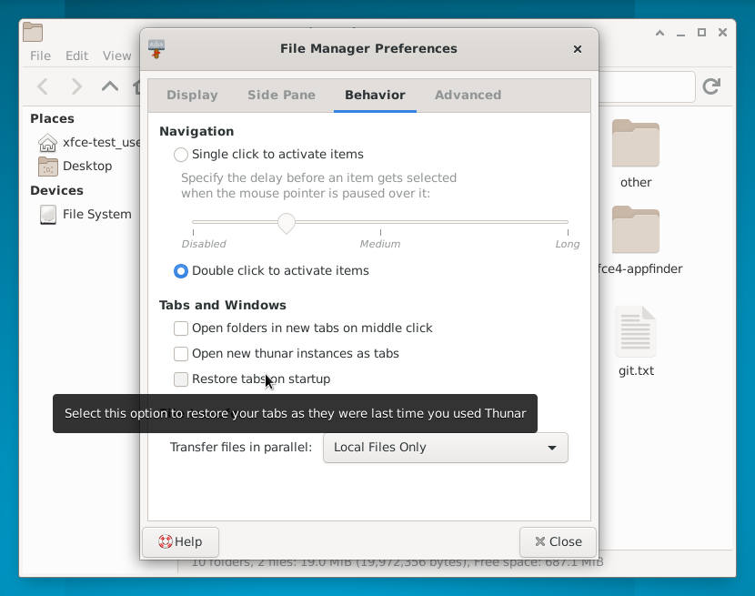
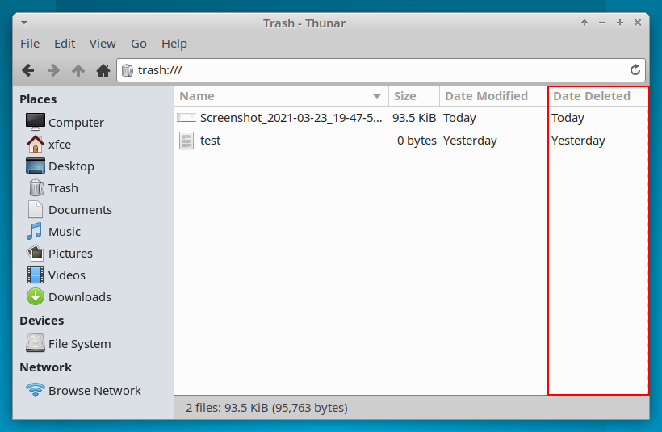

# Xfce 开发者博客 —— 一场即将到达终点的旅行 

- 原文：[A journey comes to an end](http://users.uoa.gr/~sdi1800073/sources/xfce_blog05.html)
- 作者：[Anestis Kefalidis](http://users.uoa.gr/~sdi1800073/)
- 许可证：未知
- 译者：暮光的白杨
- 日期：2021-08-17

----

## 正文

随着今年的谷歌编程之夏（ GSoC ）的结束，这一系列的博文也将迎来结束。因为这是我最后一篇有关 GSoC 的博文，所以我决定总结一下我对 Xfce 的贡献，并让你了解一下我在可预见的将来所准备做的事情。如果你读过我以前的文章，你可以直接跳到最后，因为你已经读过了我要写的大部分内容。

### 已经完成了什么？

我的项目目标是改进 [Thunar](https://docs.xfce.org/xfce/thunar/start) 的各个方面，处理存在的数个重要缺陷。在大约两个半月的时间中，我做出了如下贡献：

- 添加缩放级别作为每个目录的设置 [MR](https://gitlab.xfce.org/xfce/thunar/-/merge_requests/114)（合并请求），使用户能够在打开目录时恢复其缩放级别。
- 支持 GTK-Recent [MR](https://gitlab.xfce.org/xfce/thunar/-/merge_requests/115)，增加对 recent:/// 位置的支持，以及所有这一切所带来的。  
    
- 为已删除的文件提供额外的菜单项目：“恢复和打开文件夹” [MR](https://gitlab.xfce.org/xfce/thunar/-/merge_requests/118), 让用户直接打开从回收站恢复的文件所在的文件夹。
- 添加一个用于恢复启动页的列表选项 [MR](https://gitlab.xfce.org/xfce/thunar/-/merge_requests/120), 或者像其他程序中所说的 “恢复最后一个会话” 的设置项。  
    
- 支持共享的缩略图库 [MR](https://gitlab.xfce.org/xfce/thunar/-/merge_requests/126), 使 Thunar 成为相对较少的支持 [freedesktop.org](http://freedesktop.org/) 缩略图规范的 [#SHARED](https://specifications.freedesktop.org/thumbnail-spec/thumbnail-spec-latest.html#SHARED) 部分的程序之一。关于这一点的更多信息，我已经在之前的博文中上传了一段视频。
- 改进了 Thunar 的搜索功能 [MR](https://gitlab.xfce.org/xfce/thunar/-/merge_requests/136)，这完全重构了 Thunar 的搜索功能，并让 [Catfish](https://docs.xfce.org/apps/catfish/start) 更易于通过 Thunar 直接调用。
- 一些错误修复和小增改。

此外，自从我开始在 Thunar 上工作以来，在今年的 GSoC 开始时，我致力于改进 `Trash`（回收站）的位置，增加了一个新的 `Date Deleted`（删除日期）列，并使 `Empty`（清空）和 `Restore`（恢复）的动作更容易操作。

我还对 `Renamer` 进行了小的改进，并处理了 Thunar 的各种小错误或缺失的功能。

### 未来要做什么？

谷歌代码之夏可能要结束了，但我的工作还没有完成。我将继续努力增加一个合适的递归搜索。在这方面已经取得了很大的进展，但性能还没有完全达到要求。除此之外，我还想给 Thunar 的用户提供一个选项，让他们能够轻松地创建共享缩略图库，这一点我可能会通过一个新的插件来实现。

### 致谢

总而言之，我获得了很大的乐趣，我非常期待继续与 Xfce 社区一起工作，改进 Xfce 桌面环境。我要感谢我的导师 Alexander Schwinn ( @alexxcons )，感谢他一直以来的支持和出色的指导，以及他冷静和积极的态度。我还要感谢 Yousuf Philips ( @philipz )，他推广了我们所有的工作、帖子和视频，并且是一个非常友好和亲切的交谈对象（在我第一次接触 Xfce 社区时，这一点特别好）。

<iframe width="315" height="185" src="https://www.youtube.com/embed/tntec9uABXU" title="YouTube video player" frameborder="0" allow="accelerometer; autoplay; clipboard-write; encrypted-media; gyroscope; picture-in-picture" allowfullscreen></iframe>

<iframe width="315" height="185" src="https://www.youtube.com/embed/BAEHtwsWBqA" title="YouTube video player" frameborder="0" allow="accelerometer; autoplay; clipboard-write; encrypted-media; gyroscope; picture-in-picture" allowfullscreen></iframe>

我所有的 Thunar 合并请求（ Merge Requests ）的链接：[链接](https://gitlab.xfce.org/xfce/thunar/-/merge_requests?scope=all&utf8=%E2%9C%93&state=all&author_username=SKefalidis)