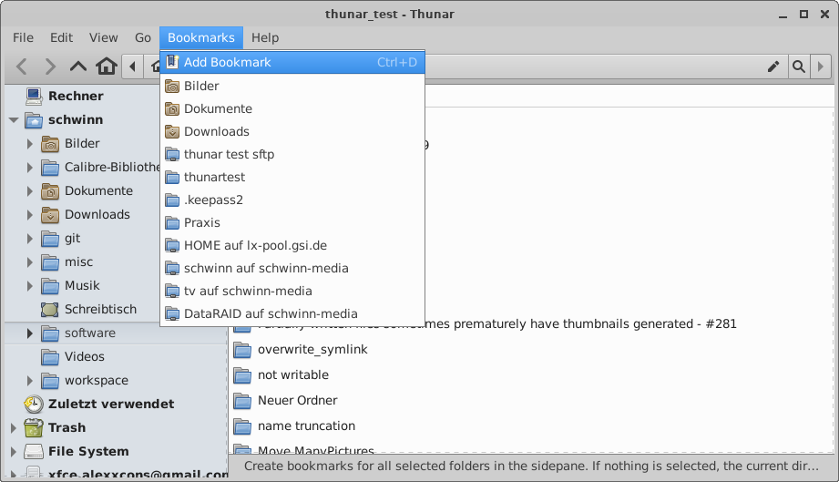
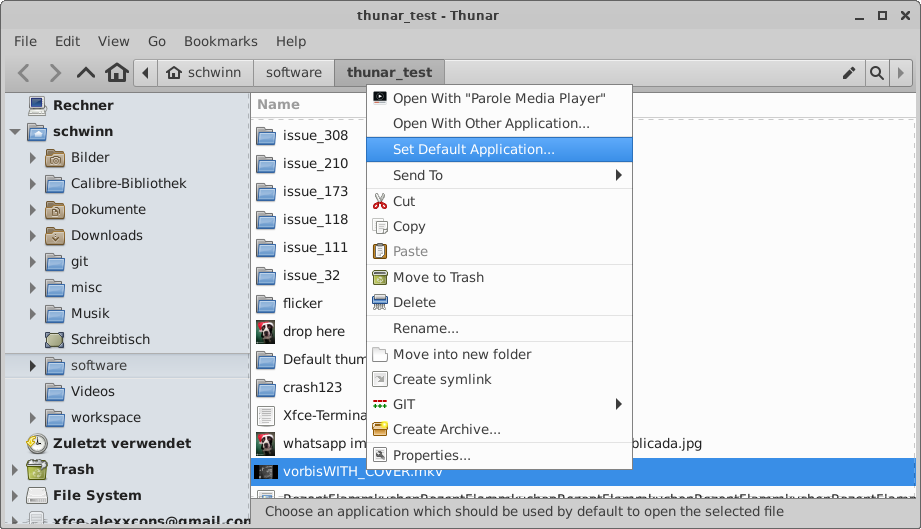
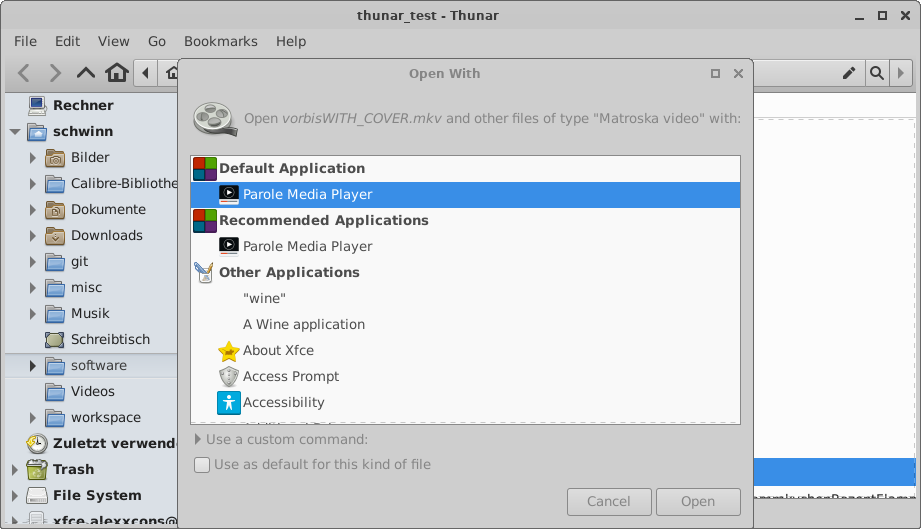

# Xfce 开发者博客 —— 得益于 GSoC 2021，Thunar 中出现了闪亮的新事物。 

- 原文：[Shiny new things in Thunar thanks to GSoC 2021](https://alexxcons.github.io/2021/09/11/shiny-new-things-in-thunar.html)
- 作者：[Alexander Schwinn](https://gitlab.xfce.org/alexxcons)
- 许可证：未知
- 译者：暮光的白杨
- 日期：2021-09-12

----

## 正文

[GSoC 2021](https://summerofcode.withgoogle.com/) 已经结束，我很高兴地告诉你，在 thunar 上工作的两个学生都做得很好。由于他们的努力，已经增加了很多好东西。

为了让你发现所有这些新功能，[Thunar 4.17.5](https://mail.xfce.org/pipermail/xfce-announce/2021-September/001059.html) 刚刚发布（请注意，这是一个开发版本。它仍然可能有一些粗糙的边缘）。

关于新功能的细节，请查看 Sergios 和 Yongha 提供的摘要：

- [Sergios GSoC Summary](http://users.uoa.gr/~sdi1800073/sources/xfce_blog05.html)
- [Yongha’s GSoC Summary](https://dev.ikx.kr/GSOC-6th/)

除了这些，这里还有一些在 GSoC 期间增加的新功能，我认为它们值得一提：

- 书签被移到一个单独的 “书签菜单” 中，并增加了 “创建书签” 选项（[MR! 109](https://gitlab.xfce.org/xfce/thunar/-/merge_requests/109) 和 [MR! 71](https://gitlab.xfce.org/xfce/thunar/-/merge_requests/71)）：  
    
- 在 “打开方式” 子菜单中增加了一个新的菜单项 “设置默认应用程序”（[MR! 79](https://gitlab.xfce.org/xfce/thunar/-/merge_requests/79)）:  
    
- 在 "thunar-chooser-dialog "中增加了一个新的部分 “默认应用程序”([MR! 81](https://gitlab.xfce.org/xfce/thunar/-/merge_requests/81)）：  
    

此外，还有[各种开放的合并请求](https://gitlab.xfce.org/xfce/thunar/-/merge_requests)，其中大部分是来自 GSoC 的学生，我目前没有时间处理这些请求。所以希望更多的新功能能很快到来!

你也可以关注一下 [xfce4-terminal](https://gitlab.xfce.org/apps/xfce4-terminal)，它最近有很多活动，因为它现在是由 Sergios Kefalidis 维护。

如果你发现这些新功能的错误，请使用 [xfce 错误追踪器](https://gitlab.xfce.org/xfce/thunar)。

测试愉快！