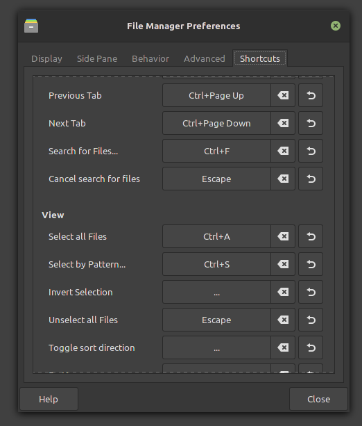
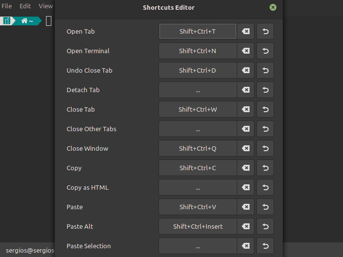

# Xfce 开发者博客 —— Xfce 的快捷方式编辑器和其他一些东西 

- 原文：[A shortcuts editor for Xfce and a couple of other things](http://users.uoa.gr/~sdi1800073/sources/xfce_blog08.html)
- 作者：[Anestis Kefalidis](http://users.uoa.gr/~sdi1800073/)
- 许可证：未知
- 译者：暮光的白杨
- 日期：2021-11-26

----

## 正文

欢迎来到另一个 Xfce 开发更新！ 在本文中，你将了解新的 Xfce 快捷方式编辑器和一些即将推出的 Thunar 功能。

### 快捷方式编辑器

你可能知道，我是 xfce4-terminal 的维护者和 Thunar 的开发者。碰巧这两个程序都有很多快捷方式。到目前为止，还没有用于更改快捷方式的 GUI。用户必须手动编辑 `accels.scm` 文件，这是可行但很麻烦的。

此外，xfce4-terminal，作为一个终端模拟器，有一个问题，就是它的快捷键与终端应用程序的快捷键相冲突，导致它们无法使用。要解决该问题，用户需要再次深入 `accels.scm` 文件并手动更改默认快捷方式。

这就是为什么我在 libxfce4ui 中创建了一个名为 XfceShortcutsEditor 的新小部件。 使用 XfceGtkActionEntries 作为其加速器的应用程序可以轻松地将该编辑器集成到其 UI 中，并在不增加任何复杂性的情况下享受这些好处。

XfceShortcutsEditor 集成在 Thunar 的首选项对话框中：

XfceShortcutsEditor 作为 xfce4 终端的单独对话框：

### Thunar 改进

就 Thunar 的具体改进而言，我很高兴地宣布，下一版本的 Thunar 将具有可自定义的状态栏。 通过右键单击，用户将能够隐藏或显示他们（不需要）需要的信息。

此外，文件夹属性对话框现在显示文件夹的内容类型（即文件夹内的文件和文件夹数量）。

- 相关视频：
    * [Thunar: Shortcuts Editor and Customizable Statusbar](https://youtu.be/sL6lXPnN9CM)