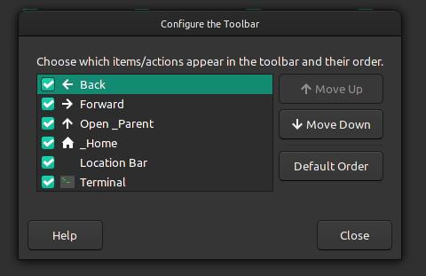
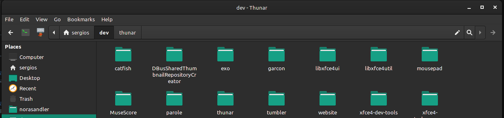

# Xfce 开发者博客 —— 更好的 Thunar 工具栏 

- 原文：[A better toolbar for Thunar](http://users.uoa.gr/~sdi1800073/sources/xfce_blog10.html)
- 作者：[Anestis Kefalidis](http://users.uoa.gr/~sdi1800073/)
- 许可证：未知
- 译者：暮光的白杨
- 日期：2022-01-21

----

欢迎来到我 2022 年的第一次 Xfce 开发更新。新年快乐！

## 工具栏和自定义操作

### 问题

过去，关于工具栏及其应包含哪些项目的讨论相当多。开发人员和社区成员都想知道：“是否应该删除重新加载按钮？”，“为什么搜索按钮不是工具栏中的切换按钮？”，“工具栏中是否应该存在切换按钮？”。正如你所料，这些问题没有完美的答案。有些人喜欢一件事，有些人喜欢完全相反的东西。

- 相关讨论详见：
    * [移动重新加载按钮](https://gitlab.xfce.org/xfce/thunar/-/merge_requests/99)
    * [移除重新加载按钮](https://gitlab.xfce.org/xfce/thunar/-/merge_requests/125)
    * [将搜索按钮移动到工具栏](https://gitlab.xfce.org/xfce/thunar/-/issues/621)
    * [在工具栏中添加缩放按钮](https://bugzilla.xfce.org/show_bug.cgi?id=11589)

### 解决方案

新提交的[合并请求 173](https://gitlab.xfce.org/xfce/thunar/-/merge_requests/173) 引入了自定义工具栏的能力。 这是通过一个新的 “工具栏编辑器” 完成的，它基于现有的 “列编辑器”，用户可以在其中重新排序和隐藏工具栏项目。  
      

我没有满足于使用内置项目自定义工具栏的能力，而是决定更进一步，让用户可以选择向其中添加自定义操作。目前，只有在目录上使用的操作才能显示为工具栏中的项目，但将来如果有用户需求，我们可以扩展该功能。  
    

## 其他改进

我也一直在进行一些较小的改进。Thunar 现在可以处理包含 “Tab” 键的快捷方式，我正在制作一个微调器元素的原型，让用户知道何时进行搜索。

## 未来的计划

这可能是我将为 Thunar 4.18 开发的最后一个重要功能。合并后，我可能会专注于修复回归和错误。

- 相关视频：
    * [Xfce Thunar Development: Shortcuts Editor and Customizable Statusbar](https://www.youtube.com/watch?v=sL6lXPnN9CM)