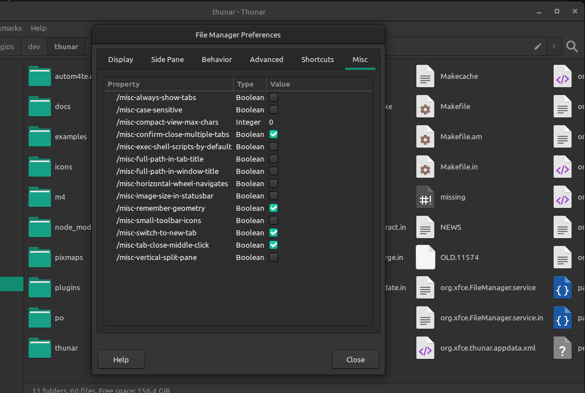

# Xfce 设置的图形界面

- 原文：[Settings GUI](http://users.uoa.gr/~sdi1800073/sources/xfce_blog13.html)
- 作者：Sergios - Anestis Kefalidis
- 许可证：不明
- 译者：暮光的白杨
- 日期：2022 年 4 月 23 日

---

欢迎回来！ 是时候谈谈隐藏的首选项了。

## 问题

这是一个阳光明媚的日子，你启动了使用 Xfce 的 PC，准备进行一些文件组织工作。你打开 Thunar，突然间你意识到了一些事情。一直以来，你都希望排序区分大小写。你打开“首选项”对话框，但遗憾的是，没有相关设置。你很失望，希望 Thunar 开发人员在未来的版本中添加这个选项。你甚至可以创建一个功能请求。

很少有人知道，Thunar 确实有启用此功能的首选项，但它被隐藏起来了。你只能在 wiki 中找到它，即使这也不能保证有效，因为我们可能会忘记更新 wiki。然后你必须在设置编辑器中手动启用它或使用 xfconf-query。

Thunar 不是唯一具有隐藏设置的 Xfce 应用程序，Terminal 是另一个具有此突出特征的应用程序，它的一些首选项不会显示在其首选项对话框中。

## 从设置编辑器到快捷方式编辑器

如果你一直关注 Xfce 的开发，你可能知道我创建了一个可以轻松集成到 Xfce 应用程序中的快捷方式编辑器小部件。目前，Thunar、Mousepad 和 Terminal 使用该小部件为用户提供了一种编辑快捷方式的简便方法。

我一直在为基于 Xfce 设置编辑器的设置开发类似的小部件。最终目标是拥有该设置编辑器的简化版本，该版本可以轻松集成到使用 xfconf 的 Xfce 应用程序中。这将使我们能够消除隐藏的首选项（或至少大大减少它们）。

## 在 Xfce 设置编辑器中搜索

我一直在研究的另一个重要功能是现有 Xfce 设置编辑器的搜索/过滤。Simon 已经开始为此做补丁，但从未完成，所以我继续他离开的地方。我不打算将此功能包含在前面描述的单独小部件中。

<iframe width="560" height="315" src="https://www.youtube.com/embed/fyzhD216Z6I" title="YouTube video player" frameborder="0" allow="accelerometer; autoplay; clipboard-write; encrypted-media; gyroscope; picture-in-picture" allowfullscreen></iframe>