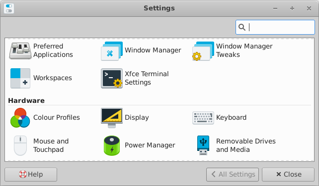
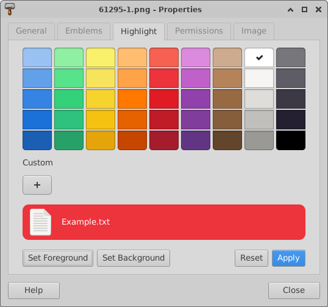
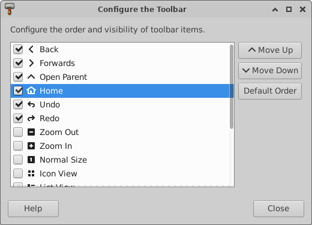
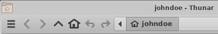
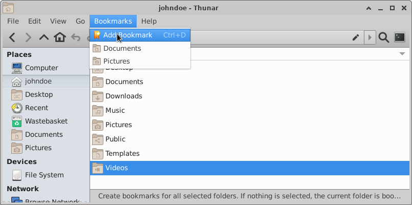
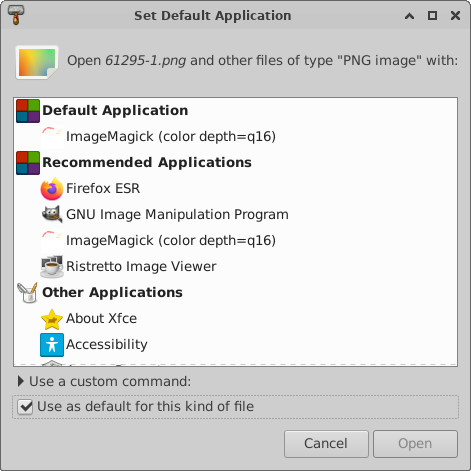
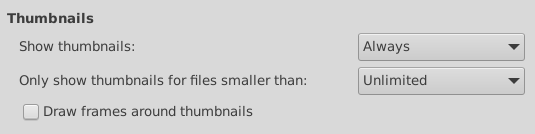

# Xfce 4.18 现已正式发布

## 译文信息

- 原文：[Xfce 4.18 Released](https://alexxcons.github.io/blogpost_8.html)
- 作者：[Alexander Schwinn](https://alexxcons.github.io/index.html)
- 许可证：© 2022 Alexander Schwinnrss
- 译者：暮光的白杨
- 日期：2022-12-15

----

经过将近两年的努力，我们很高兴地宣布 [Xfce](https://xfce.org/) 4.18 发布了！

自 Xfce 4.16 以来，发生了很多重大的发展。我们的团队添加了多个不错的新功能，修复了大量错误并进行了各种小改进。最后，如你所愿，我们把所有这些成果全部发布。

本次开发周期受到 [GSoC 2021](https://summerofcode.withgoogle.com/archive/2021/organizations/5706869816950784) 和 [GSoC 2022](https://summerofcode.withgoogle.com/programs/2022/organizations/xfce) 的很大影响，xfce 因此获得了各种新功能；其中大部分是针对 Xfce 文件管理器 Thunar。尽管如此，也有多个 Xfce 组件收到了许多人的喜爱，贡献者们在幕后为此进行许多改进工作。

假设您已经安装了 Xfce 4.16，下面是您将在升级到 Xfce 4.18 时看到的主要变化的概述：

## libxfce4ui

### XfceFilenameInput

XfceFilenameInput 是一个用于文件名输入的舒适小部件，添加它是为了在开始的时候防止无效文件名并对具体问题提供详细反馈。

{ width=370px }

{ width=370px }

### XfceShortcutsEditor

这个小部件是一个快捷方式编辑器，它的引入是为了有一个图形界面来修改特定于组件的快捷方式。目前，它仅在 Thunar、Xfce4-terminal 和 Mousepad 中使用，但对其他组件的支持可能会跟进。

{ width=350px }

## tumbler

pixbuf-thumbnailer 和调度程序的一些性能改进已经完成。现在桌面缩略图也有多个覆盖选项。

Tumbler 现在支持 `x-large` 和 `xx-large` 缩略图尺寸，这对于高分辨率显示非常有用。

Tumbler 和 Thunar 现在支持如 freedesktop.org 缩略图规范中所述的共享缩略图存储库。此功能可用于提前在图片附近的文件夹直接生成缩略图。这样，应用程序不需要为每个用户重新生成缩略图。

有关共享缩略图的更多信息，请查看[相关博客文章](http://users.uoa.gr/~sdi1800073/sources/xfce_blog03.html)。

## xfce4-panel

DateTime 和 Clock 插件提供了重复的功能。为了防止并行开发，我们已经将它们合并为一个插件。

{ width=300px }

新的时钟插件现在具有了一个新的二进制时间模式，并提供了一个睡眠监视器。这是所有可能布局的屏幕截图：模拟、二进制、数字、模糊和 LCD。

{ width=350px }

## xfdesktop

与 thunar 一样，上下文菜单中的“删除”菜单条目现在可以隐藏。

为了不在按下“重新排列桌面图标”时不小心弄乱桌面，xfdesktop 会要求用户进行操作确认。

## xfce4-settings

xfce4-settings-manager 的搜索条目有点简化。现在它将始终显示，不需要任何滑块或按钮触发。

{ width=550px }

### xfce4-display-settings

xfce4-display-settings 得到了一些小的改进，并且可以决定在连接新显示器时要做什么。

{ width=550px }

### xfce4-appearance-settings

选择新主题时，现在可以选择自动设置匹配的 xfwm4 主题（如果可用）。

{ width=350px }

### xfce4-settings-editor

现在可以使用新的搜索小部件快速找到特定设置。

{ width=600px }

## thunar

### 列表视图

对于目录，包含文件的数量现在可以显示在大小列中。现在可以添加“文件创建日期”列，并且可以通过右键单击任何列标题来打开“配置列”对话框。

{ width=400px }

{ width=550px }

### 图片预览

最后，Thunar 添加了一个图像预览侧面板。不，等等，实际上是两个！您可以选择使用不占用额外空间但会隐藏左侧窗格部分的“嵌入”模式。或者您可以选择“独立”模式，该模式将在右侧使用一个单独的窗格并显示一些基本信息。

{ width=550px }

{ width=550px }

### 撤销与恢复

现在可以撤消或恢复基本文件操作。撤消和恢复可用于“移动”、“重命名”、“删除”、“创建链接”和“新建文件夹/文件”操作。默认情况下，Thunar 会存储最近 10 次操作的历史记录，但历史记录长度是可配置的。每当触发撤消/恢复时，都会显示一条包含少量详细信息的通知。

{ width=550px }

### 文件高亮

现在可以通过将背景和文件名设置为不同的颜色来突出显示文件。这可以通过位于“属性”对话框中的附加选项卡来完成。视图菜单提供了一个复选框以启用/禁用该功能。启用后，文件现在可以以彩虹的所有颜色显示。

{ width=350px }

{ width=500px }

{ width=500px }

有关文件突出显示的更多信息，请查看[相关博客文章](https://elessar-space.blogspot.com/2022/08/gsoc22-file-highlighting-in-thunar.html)。

### 工具栏

现在您可以根据个人需求自定义工具栏！为此我们添加了一个附加对话框，您可以在其中管理特定项目的可见性和位置，以及在工具栏中使用的，为文件夹显示的自定义操作。

隐藏菜单栏时，Thunar 将显示一个可用于显示菜单的附加工具栏按钮。

{ width=600px }

{ width=500px }

有关可配置工具栏的更多信息，请查看[相关博客文章](http://users.uoa.gr/~sdi1800073/sources/xfce_blog10.html)。

### 拆分视图

Thunar 现在提供使用拆分视图的选项。窗格分隔符可以移动，其位置将被存储。通过调整 xfconf 设置，也可以进行垂直拆分。

{ width=600px }

### 状态栏

状态栏样式进行了调整，`|` 现在用于分隔条目。此外，现在可以使用上下文菜单对其进行自定义。

{ width=600px }

### 递归搜索

Thunar 现在可以直接在 Thunar 内部进行递归搜索。搜索在单独的线程中完成，搜索结果会快速添加到列表视图中。新的“位置”行显示搜索结果所在的位置，上下文菜单提供“打开项目位置”选项以便快速前往那里。首选项对话框提供了一个选项，用于将递归搜索限制为本地文件夹，或将其禁用。

{ width=600px }

{ width=500px }

有关递归搜索功能的更多信息，请查看[相关博客文章](http://users.uoa.gr/~sdi1800073/sources/xfce_blog04.html)。

### 最近文件（Recent）

现在可以在侧窗格中访问最近使用的文件。与“递归搜索”功能一样，新的“位置”行可以在列表视图中使用。此外，对于 “Recent”，可以添加新行“新近度（Recency）”以按文件的最新使用情况对文件进行排序。

{ width=600px }

有关 Thunar 中“最近文件”的更多信息，请查看相关[博客文章](http://users.uoa.gr/~sdi1800073/sources/xfce_blog02.html)。

### 书签菜单

为了使“开始”菜单保持紧凑，书签已移至一个单独的新“书签”菜单中。在 Thunar 4.16 中，“添加书签”菜单项隐藏在“发送至”菜单中。作为新“书签”菜单的一部分，它现在更加突出。

{ width=600px }

### 回收站目录

在新版本中，回收站目录提供了一个信息栏，可以轻松访问“清空回收站”和“恢复”功能。使用列表视图时，将显示“删除日期”列，以便可以按删除日期对文件进行排序。通过上下文菜单，现在可以选择“恢复并显示”，以便在恢复文件的文件夹中自动打开一个新选项卡。

{ width=600px }

### 默认应用

Thunar 改进了为特定 MIME 类型设置/取消设置默认应用程序的管理。上下文菜单有一个专门的项目，“设置默认应用程序”，它将打开 `ApplicationChooserDialog` 并预选“用作默认值”。该对话框现在有一个“默认应用程序”部分，以便表明当前设置的是哪个默认应用程序。如果您想从列表中删除应用程序，请右键单击它并选择“忘记关联”。

{ width=570px }

### 自定义操作

现在可以在级联子菜单中安排自定义操作。您只需为自定义操作输入相同的子菜单名称，以便将其放入相同的菜单中。如果您需要多个菜单级别，您可以通过在“子菜单”条目的路径中使用“/”来实现。

### 首选项

首选项对话框中的缩略图设置被组合在一起，同时可以限制生成缩略图的文件大小。通过防止为巨大的视频文件生成缩略图来应该可以减轻可能的性能问题。

文件传输操作现在可以选择使用 `*.partial~` 作为中间文件。传输操作后，现在可以选择验证文件校验和，以确保没有任何部分被损坏。请注意，在复制过程中使用校验和功能需要一些额外的时间完成复制操作。

有关新文件传输选项的更多信息，请查看[相关博客文章](https://dev.ikx.kr/GSOC-5th/)。

Thunar 添加了一个复选框以允许运行 shell 脚本。在 Thunar 4.16 中，您只能通过更改隐藏设置来更改该行为。谨慎使用该选项！

Thunar 现在可以在启动时恢复选项卡，并在选项卡标题中显示完整的目录路径。

## xfce4-appfinder

### 配置

Appfinder 获得了对 `PrefersNonDefaultGPU` 属性的支持，这对于具有双显卡的系统很有用。

在折叠模式下传递时，现在会解析环境变量。

### 外观

新版本添加了隐藏窗口装饰的选项。

{ width=500px }

## xfwm4

### 工作区

工作区设置现在也可以与其他窗口管理器一起使用。

### 混成器

混成器现在支持使用 GLX 的自适应垂直同步。

## 通用

### 缩放

新版本改进了对 UI 缩放的支持，并修复了使用缩放时核心组件中的许多模糊图标。 这对于 HiDPI 屏幕特别有用。

### 窗口标题栏

默认情况下，Xfce 窗口/会话的所有标题栏现在都将由窗口管理器（Xfwm4）绘制。部分对话框支持 `GtkHeaderBar`（CSD）功能，你可以通过 xfconf 设置启用它。

为了便于阅读，此列表仅显示主要亮点。请查看完整的 [Xfce 4.18 变更日志](https://www.xfce.org/download/changelogs)以获取详细的变更列表。

此摘要也可以看作是[本地化的在线导览](https://www.xfce.org/about/tour418)。

Xfce 4.18 可以[在这里下载](https://archive.xfce.org/xfce/4.18)，您既可一组单独的软件包，也可下载单一的，包含所有这些单独组件的压缩包文件。

此致，

Xfce 开发团队