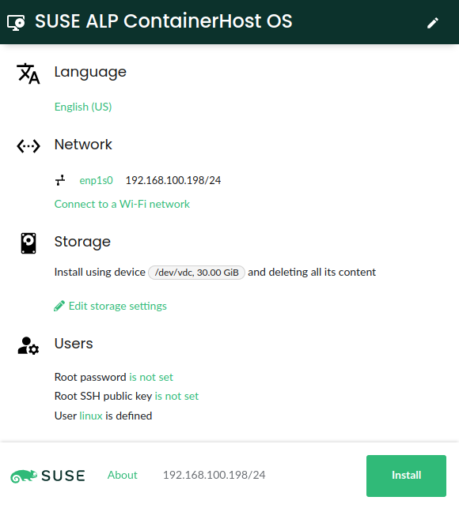
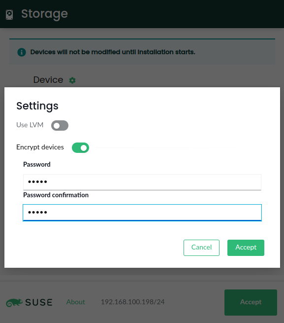

# D-Installer 需要你的帮助

## 译文信息

- 原文：[D-Installer needs your help](https://yast.opensuse.org/blog/2022-12-05/d-installer-needs-you)
- 作者：[YaST Team](https://yast.opensuse.org)
- 许可证：不明
- 译者：暮光的白杨
- 日期：2022-12-06

----

既然标题引起了你的注意，让我们从好消息开始：D-Installer 的开发进展顺利。那然后呢？回答这个问题对于区分 D-Installer 和我们提供给大家测试它的 Live ISO 镜像很重要。因此，让我们将这篇文章分成几个部分。

## 可供测试的新的 D-Installer 原型

众所周知，[D-Installer](https://github.com/yast/d-installer) 是由 YaST 团队开发的一个新应用程序，它允许将任何 openSUSE/SUSE 操作系统安装到任何虚拟机或物理机中。用户可以通过 D-Bus API（命令行界面）或现代化的 Web 图形前端控制 D-Installer。它可以直接运行在任何 Linux 系统之上，也可以作为容器执行。因此，你可以使用我们提供的用于测试的 Live ISO 运行 D-Installer，或者你可以从当前安装的 Tumbleweed 中使用它（例如，将 Leap Micro 安装在另一个磁盘中），甚至作为基于 [Iguana](https://github.com/aaannz/iguana) 的容器。

{ width=400px }

今天我们发布了一个新的 D-Installer 原型，修复了早期测试者报告的几个错误，并在密码和用户配置等方面改进了使用体验。但除了这些改进之外，还有一些新功能值得关注。

最明显的变化是配置存储设置的新界面。这是朝着我们几个月前[记录的](https://github.com/yast/d-installer/blob/master/doc/storage_ui.md)愿景迈出的第一步。在功能方面，D-Installer 新增了使用 LVM（[逻辑卷管理器](https://en.wikipedia.org/wiki/Logical_Volume_Manager_(Linux))）或全盘加密安装系统的功能。确切的加密类型取决于所安装的操作系统。对于 ALP ContainerHost 的原型，D-Installer 将使用 LUKS2 调整一些设置以确保一切都适用于提供的 GRUB 版本。LUKS2 的使用为未来的可能性打开了大门，比如在启动时使用系统的 TPM（[可信平台模块](https://en.wikipedia.org/wiki/Trusted_Platform_Module)）而不是输入密码来解锁加密设备。

{ width=400px }

请注意，新界面还带来了一些其他变化。在选定磁盘为新操作系统腾出空间时，旧版本的 D-Installer 模仿了 YaST 的一些默认行为，例如尝试使尽可能多的分区保持活动状态或复用现有的 LVM 结构。现在不同了。我们计划实现一个来准确决定要删除、保留或调整大小的用户界面。**但与此同时，D-Installer 将全力以赴，删除所选磁盘中所有以前的内容**。D-Installer 会发出相应的警告信息。😉

另一个相关的改进是能够在 AArch64 系统上正确配置引导加载程序。之前的原型搞乱了非 x86 系统上 GRUB 相关包的选择，但现在 D-Installer 能更好地处理不同的硬件架构。在 YaST 团队，我们没有那么多不同的 Aarch64 设备可供测试，因此我们非常感谢任何帮助测试它是否一致工作的帮助。你可以通过获取 Live ISO 的 `aarch64` 测试版本来帮助我们……这将引导我们进入下一个主题。

## D-Installer 测试 ISO 镜像

如你所知，测试 D-Installer 原型的最便捷方法是使用我们使用 D-Installer 最新的开发版本不断构建的，前文已经提到的 [Live ISO 镜像](https://github.com/yast/d-installer#live-iso-image)。但是，老实说，我们没有那么多时间（或知识）来投入到这些镜像，而且还有很大的改进空间。

首先，接近 1 GiB 的体积对于甚至不包括要安装的操作系统的软件包（所有内容都从在线存储库中获取）的镜像来说显然太大了。除了 ISO 的大小，运行 X11 和 Firefox 可能不是连接到本地 Web 界面的最节省内存的方式。GitHub 上已经有一个建议替代组件和方法的 [issue](https://github.com/yast/d-installer/issues/341)，但 YaST 团队在短期内很难解决这个问题。

就图形环境和网络浏览器而言。实际上不需要在系统启动时，就像我们当前的 live image 那样无条件地运行它们。在安装过程由另一台设备或命令行界面驱动的情况下，向镜像的引导过程添加一些模块化设计可能可以大大降低内存占用量。

此外，由于我们的 live ISO 只是基于 openSUSE Tumbleweed 进行稍微定制的一个版本，我们正在遭受最新版本中出现的一些性能问题的后果。我们将该问题报告为 [bug#1205938](https://bugzilla.suse.com/show_bug.cgi?id=1205938)，我们确实需要一些方法来修复它或解决它。该错误报告中描述的减速可能会完全破坏使用 D-Installer live ISO 镜像的整体体验。

## 加入我们！

既然通用基础设施已经设立，D-Installer 的未来看起来非常光明，我们可以继续添加所有当前缺少的功能，复用 YaST 的强大功能。 所以请加入我们的冒险。

当然，最简单的贡献方式是测试新版本并向我们提供宝贵的建设性反馈，这样我们才能不断改进当前的原型。此外，如果你能帮助改进当前测试的 Live ISO 镜像或解决前文提到的 Tumbleweed 中的性能问题，那就太好了。我们也欢迎在容器化和 Iguana 领域提供任何形式的支持。

在任何情况下，对于任何其他问题，你可以[在里可以找到我们](https://github.com/yast/d-installer/blob/master/CONTRIBUTING.md)！