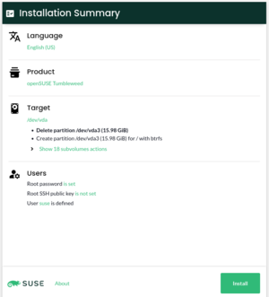
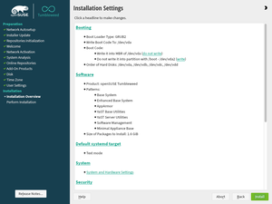
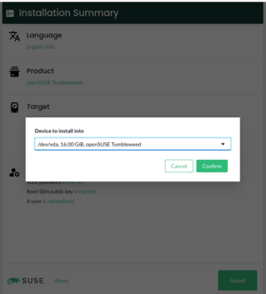
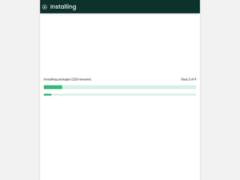
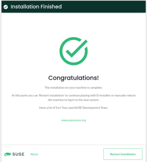

# YaST D-Installer 第一次公开发布

## 作品信息

- 原文：[D-Installer First Public Release](https://yast.opensuse.org/blog/2022-03-31/d-installer-first-public-release)
- 作者：[YaST Team](https://yast.opensuse.org/)
- 许可证：未知
- 译者：暮光的白杨
- 日期：2022-04-01

----

## 正文

我们很高兴地宣布现在可以下载基于 D-Installer 的第一个安装镜像文件。[自 1 月份我们最初宣布以来](https://yast.opensuse.org/blog/2022-01-18/announcing-the-d-installer-project)，我们一直在努力从未实施的概念验证转变为你可以实际使用的东西。

这篇文章的目的是总结项目的当前状态，以及你在不久的将来可以期待什么。此外，我们将挖掘一些内部细节，以便你对我们所遵循的路径有一个更好的概述。

## D-Installer（某种程度上）的作用

D-Installer 可以在简单的场景下安装 openSUSE Tumbleweed。但是，请记住，它仍然是一个实验性项目，所以如果你决定试一试，最好使用虚拟机。毕竟，我们不想为任何数据损失负责。😉

你可以[从 OBS 获取 Live ISO](https://build.opensuse.org/package/binaries/YaST:Head:D-Installer/d-installer-live/images)。我们会尽可能频繁地更新此镜像文件，来包含 D-Installer 最新的更改以进行测试。ISO 启动后，使用 `root` 作为用户名，`linux` 作为密码登录安装程序，你应该会看到 “Installation Summary（安装摘要）”页面。

由于我们在镜像文件中没有添加任何软件源，因此你需要将机器连接到互联网，以便它可以访问 Tumbleweed 的软件仓库。

## D-Installer 现在的样子

“Installation Summary” 页面是 D-Installer 用户界面的中心点。 它使用户能够一目了然地检查安装设置。你可以将此页面视为 YaST 中的 “Installation Settings（安装设置）” 屏幕。主要区别在于，在这种情况下，它是起点，因此你无需遍历所有向导页面即可进入。

摘要简化为几个部分：语言和产品选择、分区设置和用户管理。

不出所料，语言选择器允许在已安装的系统中设置语言。请注意，此时用户界面尚未本地化，因此不会影响安装程序本身。此外，我们希望在未来增加对更改键盘布局的支持。

到目前为止，软件选择非常有限。D-Installer 允许你选择要安装的产品，仅此而已。尚不支持选择模式或系统角色。

关于分区，D-Installer 依赖于 YaST 指导建议，尽管它只允许选择一个设备来安装系统。 我们计划提供大部分 YaST 的引导式分区设置（使用多个磁盘、选择文件系统类型等）。

最后但同样重要的是，D-Installer 允许配置 root 的身份验证（密码或 SSH 公钥）和/或创建第一个用户以登录已安装的系统，类似于 YaST 所支持的功能。

调整安装选项后，单击 `install` 按钮开始安装。

## YaST、D-Bus、React 和 Cockpit

我们承诺会深入研究细节，所以我们开始吧。在架构方面，该方法与我们在最初公告中描述的方法没有太大变化。它由三个不同的部分组成：系统服务、D-Bus 界面和 Web 用户界面。

核心是 D-Installer 系统服务，它使用 YaST 库来检查和安装系统。我们正在尽可能多地复用 YaST 代码，但同时我们尝试只使用我们需要的代码。该服务提供了一个 D-Bus 接口，因此用户界面可以与之交互。我们试图保持 D-Bus 接口与业务逻辑的分离，尽管我们不打算用其他任何东西来替换它。

关于用户界面，我们决定使用 [PatternFly](https://www.patternfly.org/) 组件构建一个 [React](https://reactjs.org/) 应用程序。为什么选择 PatternFly？ 如果你继续阅读，你将在一分钟内了解原因。:-)

我们所描述的组件如何相互通信？ 这是一个有趣的问题。我们决定依靠 [Cockpit](https://cockpit-project.org/)，而不是推出我们自己的解决方案。所以我们使用 Cockpit 的基础设施（通过 D-Bus）来连接 UI 和系统服务。我们甚至使用 Cockpit 的网络服务器来暴露安装媒介中的用户界面。

## 未来可期待什么

我们在这次迭代中学到了很多东西，所以我们将利用这些知识来制定路线图。但是，我们希望尽快开展一些区域，这些区域应该在这样的路线图中占据突出位置。现在让我们来看看其中的一些东西。

### 错误报告和用户交互

我们的 D-Installer 服务可以发送有关其当前状态和安装进度的信息。但是，它在错误报告方面非常糟糕，并且无法向用户询问其他信息。例如，如果在分析存储设备时发现加密磁盘，它不会执行任何询问密码的机制。

我们认为这是一个关键要求，因此我们希望在下一次迭代中开发一个可靠的解决方案。

### 更好的软件处理

选择产品不仅仅是选择一组软件包：它可能会影响安装程序的行为。例如，如果要安装 MicroOS，则需要调整分区建议以将根文件系统挂载为只读。更不用说显示产品的许可证或发行说明。所以事情没那么简单。

而且，我们有*系统角色*的概念，可能会影响到软件的选择、服务的配置等。

由于有许多活动部分，我们需要定义软件处理的进展程度。当然，许可证和发行说明是必须的。 但是我们是否计划支持系统角色？ 很可能会支持。将支持哪些选项？ 那么选择模式或只是单独的包呢？还有太多未解决的问题。

### 支持完整的指导性提案

我们不打算很快将分区程序带到 Web 界面。相反，我们的计划是支持所有引导式分区选项，因此你可以选择多个设备、选择不同的文件系统、启用 LVM 和使用加密等。因此，从中期来看，这看起来是一个公平的交易。

### 用户界面

我们认为用户界面对于第一次迭代来说已经足够好了，但是鉴于我们计划添加对更多功能的支持，我们需要与我们的 UX 专家合作来改进整体方法。例如，到处使用弹出式窗口是远远不够理想的。

更不用说，虽然我们使用的是 PatternFly，但我们试图坚持 [EOS 设计系统](https://www.eosdesignsystem.com/)的原则，所以我们可能需要一些帮助。

### 分享你的观点

既然你有东西要尝试，如果你能分享你的意见，那就太好了。您可以通过 [GitHub 项目页面](https://github.com/yast/d-installer)联系我们，或者像往常一样在 [Libera.chat](https://libera.chat/) 的 `#yast` 频道或 [YaST 开发邮件列表](https://lists.opensuse.org/archives/list/yast-devel@lists.opensuse.org/)中联系我们。

祝你玩得愉快！

